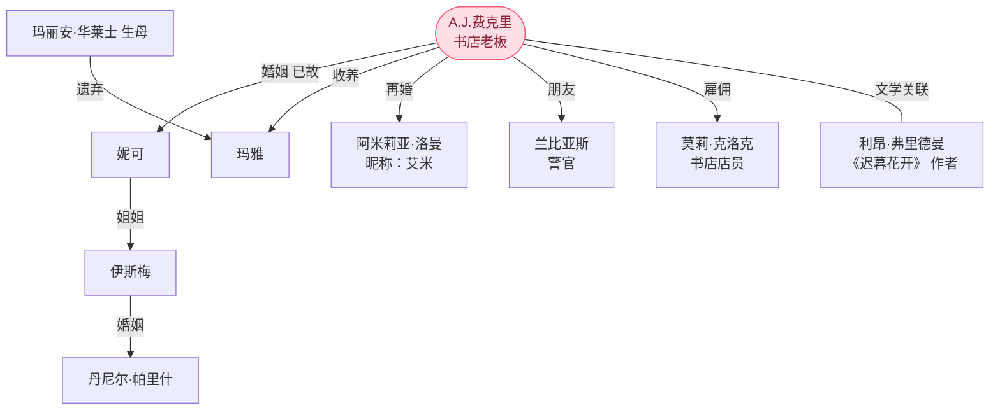

| 人物                    | 身份        | 身份说明                                          |
| --------------------- | --------- | --------------------------------------------- |
| A.J.费克里               | 主人公，书店老板  | 非艾丽丝岛的本地居民，婚后和妻子到此岛定居，妻子妮可去世后独居，后收养玛雅，与阿米莉亚结婚 |
| 妮可（Nicole）            | A.J.亡妻    | 生前负责书店童书业务，性格外向，车祸去世                          |
| 玛雅（Maya）              | 被遗弃的女孩    | 被A.J.收养，成为其精神与情感转折点                           |
| 阿米莉亚·洛曼（Amelia Loman） | 出版社销售代表   | 后成为A.J.妻子、玛雅继母，昵称艾米（Amy）                      |
| 伊斯梅                   | 妮可的姐姐     | A.J.的大姨子，中学教师                                 |
| 丹尼尔·帕里什               | 伊斯梅的丈夫    | A.J.的连襟，作家，早期作品比较畅销，喜欢拈花惹草                    |
| 兰比亚斯警官（Lambiase）      | 当地警察      | 透过接触A.J.逐渐喜欢读书，成为A.J.的朋友                      |
| 利昂·弗里德曼               | 《迟暮花开》的作者 |                                               |
| 莫莉·克洛克                | 书店店员      |                                               |
| 玛丽安・华莱士               | 玛雅的生母     |                                               |
## 图示

