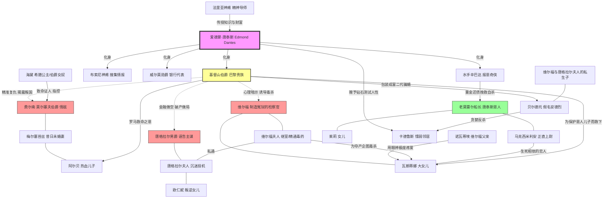
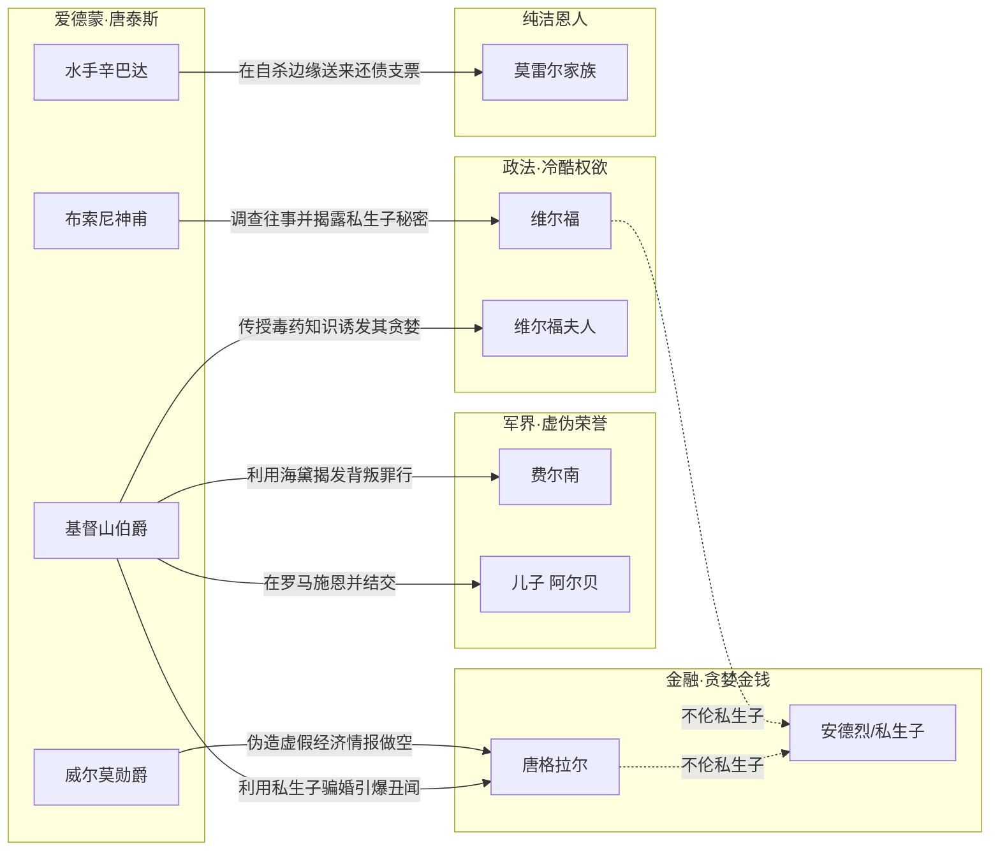

## 全景人物关系脉络图

```mermaid
graph TD
    Dantes[爱德蒙·唐泰斯 Edmond Dantes]
    Faria[法里亚神甫 精神导师]
    Faria -->|传授知识与财富| Dantes

    Dantes -->|化身| Count[基督山伯爵 巴黎贵族]
    Dantes -->|化身| Busoni[布索尼神甫 搜集情报]
    Dantes -->|化身| Wilmore[威尔莫勋爵 银行代表]
    Dantes -->|化身| Sinbad[水手辛巴达 报恩奇侠]

    Fernand[费尔南 莫尔塞夫伯爵 情敌]
    Mercedes[梅尔塞苔丝 昔日未婚妻]
    Albert[阿尔贝 热血儿子]
    Haydee[海黛 希腊公主/伯爵女奴]

    Count -.->|精准复仇 揭露叛国| Fernand
    Fernand --- Mercedes
    Mercedes --- Albert
    Haydee -->|致命证人 指控| Fernand
    Count -->|罗马救命之恩| Albert

    Danglars[唐格拉尔男爵 诬告主谋]
    DanglarsW[唐格拉尔夫人 沉迷投机]
    Eugenie[欧仁妮 叛逆女儿]
    Benedetto[贝尔德托 假名安德烈]

    Count -.->|金融做空 破产做局| Danglars
    Danglars --- DanglarsW
    DanglarsW --- Eugenie
    Count -->|包装成富二代骗婚| Benedetto

    Villefort[维尔福 制造冤狱的检察官]
    VillefortW[维尔福夫人 继室/精通毒药]
    Valentine[瓦朗蒂娜 大女儿]
    Noirtier[诺瓦蒂埃 维尔福父亲]

    Count -.->|心理暗示 诱导毒杀| Villefort
    Villefort --- VillefortW
    Villefort --- Valentine
    Noirtier -->|用眼神极度疼爱| Valentine
    VillefortW -->|为夺产企图毒杀| Valentine
    VillefortW ---|私通| DanglarsW
    BenedettoReal[维尔福与唐格拉尔夫人的私生子] --- Benedetto

    Morrel[老莫雷尔船长 唐泰斯恩人]
    Max[马克西米利安 正直上尉]
    Julie[茱莉 女儿]

    Sinbad -->|重金还债挽救自杀| Morrel
    Morrel --- Max
    Morrel --- Julie
    Max ---|生死相依的恋人| Valentine
    Count -->|为保护恩人儿子而救下| Valentine

    Caderousse[卡德鲁斯 懦弱邻居]
    Dantes -->|赠予钻石测试人性| Caderousse
    Benedetto -->|贪婪反杀| Caderousse

    style Dantes fill:#f9f,stroke:#333,stroke-width:4px
    style Count fill:#ff9,stroke:#333,stroke-width:2px
    style Fernand fill:#f99,stroke:#333
    style Danglars fill:#f99,stroke:#333
    style Villefort fill:#f99,stroke:#333
    style Morrel fill:#9f9,stroke:#333

```

---

## 仇人阵营与伯爵马甲对照图

这张图更精简，主要展示主角用哪个“马甲”去针对哪个“仇人”，非常适合看连载时随时对号入座：

```mermaid
flowchart LR
    subgraph 伯爵的复仇中枢 [爱德蒙·唐泰斯]
        C[基督山伯爵]
        B[布索尼神甫]
        W[威尔莫勋爵]
        S[水手辛巴达]
    end

    subgraph 莫尔塞夫家 [军界·虚伪荣誉]
        F[费尔南]
        A[儿子 阿尔贝]
        C -->|利用海黛揭发背叛罪行| F
        C -->|在罗马施恩并结交| A
    end

    subgraph 唐格拉尔家 [金融·贪婪金钱]
        D[唐格拉尔]
        DK[安德烈/私生子]
        W -->|伪造虚假经济情报做空| D
        C -->|利用私生子骗婚引爆丑闻| D
    end

    subgraph 维尔福家 [政法·冷酷权欲]
        V[维尔福]
        VW[维尔福夫人]
        B -->|调查往事并揭露私生子秘密| V
        C -->|传授毒药知识诱发其贪婪| VW
    end

    subgraph 莫雷尔家 [纯洁恩人]
        M[莫雷尔家族]
        S -->|在自杀边缘送来还债支票| M
    end

    %% 仇人之间的隐秘交集
    V -.->|不伦私生子| DK
    D -.->|不伦私生子| DK
```

